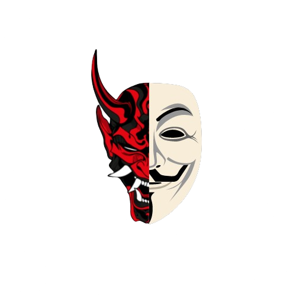

# Rasperon Cipher Factory

---

## Description / Açıklama

Rasperon Cipher Factory is a Python program that provides advanced data encryption and decryption using AES encryption algorithm. It offers a command-line interface (CLI) with a user-friendly interaction.

Rasperon Şifreleme Fabrikası, AES şifreleme algoritmasını kullanarak gelişmiş veri şifreleme ve deşifreleme sağlayan bir Python programıdır. Kullanıcı dostu bir etkileşim ile bir komut satırı arabirimi (CLI) sunar.

---

## Features / Özellikler

- Encrypt plaintext to ciphertext / Düz metni şifreleyin.
- Decrypt ciphertext to plaintext / Şifrelenmiş metni deşifre edin.
- User-friendly CLI interface. / Kullanıcı dostu CLI arayüzü.
- Supports both Turkish and English languages. / İngilizce ve Türkçe dillerini destekliyor

---

## Usage / Kullanım

1. Clone this repository / Bu depoyu klonlayın.
```bash
git clone https://github.com/rasperon/data-security.git
```

2. Navigate to the project directory / Proje dizinine gidin.
```bash
cd data-security
```

3. Run the main.bat file / main.bat dosyasını çalıştırın.

--->3.1  Alternatively you can run `pip install rich cryptography` / Alternatif olarak `pip install rich cryptography` çalıştırabilirsiniz.

## Dependencies / Bağımlılıklar

- rich
- cryptography

---

## License / Lisans

This project is licensed under the MIT License - see the [LICENSE](LICENSE) file for details.

Bu proje MIT Lisansı altında lisanslanmıştır - ayrıntılar için [LICENSE](LICENSE) dosyasına bakın.

---

## Contribution / Katkıda Bulunma

1. Fork the repository / Depoyu forklayın.
2. Create a new branch / Yeni bir dal oluşturun.
3. Make your changes / Değişikliklerinizi yapın.
4. Commit your changes / Değişikliklerinizi commitleyin.
5. Push to the branch / Dalınıza pushlayın.
6. Create a pull request / Bir pull request oluşturun.

---

## Credits / Katkı Sağlayanlar

- [@Rasperon](https://github.com/rasperon) - Ben tanrının yalnız adamıyım, yalnızlık benim kaderim. /  I am God's lonely man, loneliness is my destiny.

---

## Contact / İletişim

For any inquiries or collaborations, please contact us at: /
Herhangi bir soru veya işbirliği için lütfen bize ulaşın: 
[](https://discord.com/users/1108799838876868738)
<center>
<a href="https://discord.gg/corleonedev"></a>
</center>
